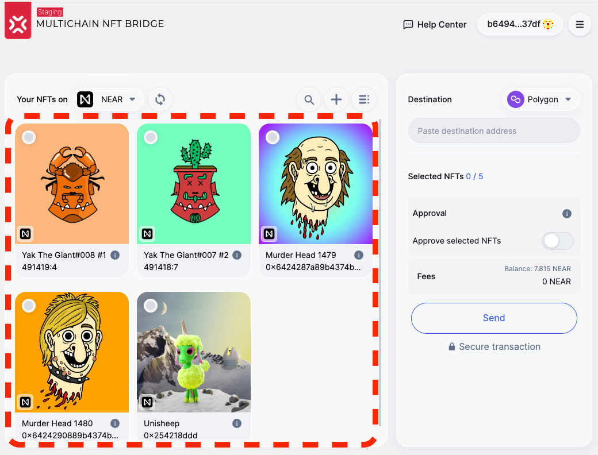
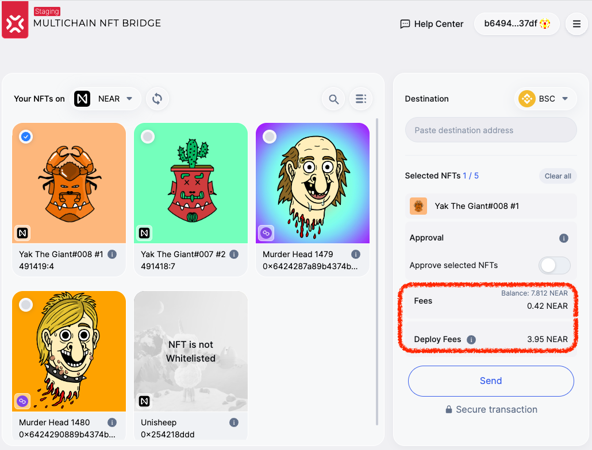
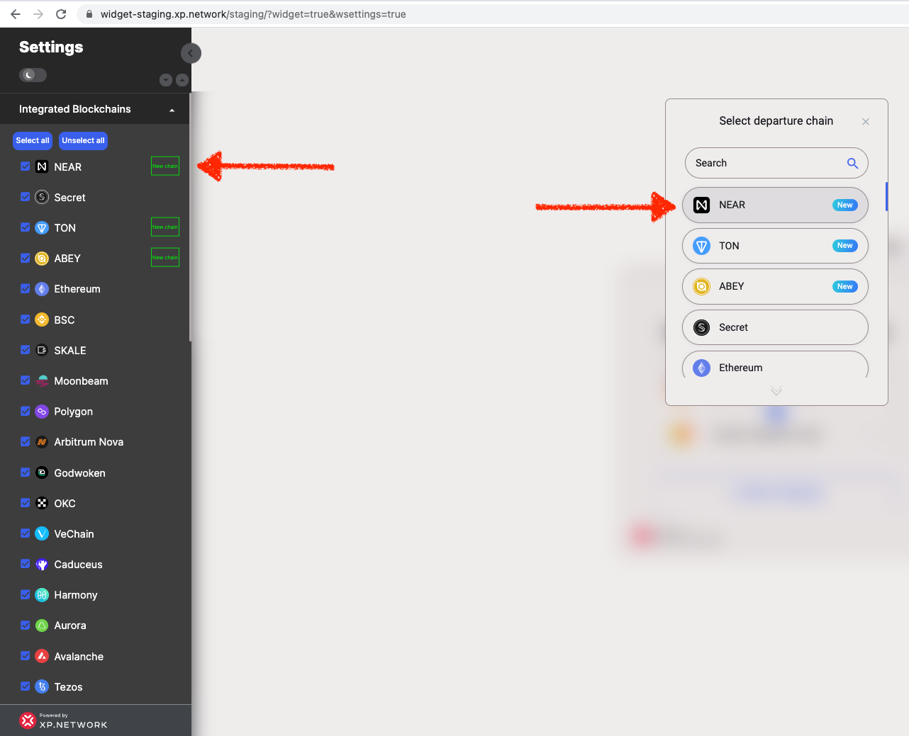
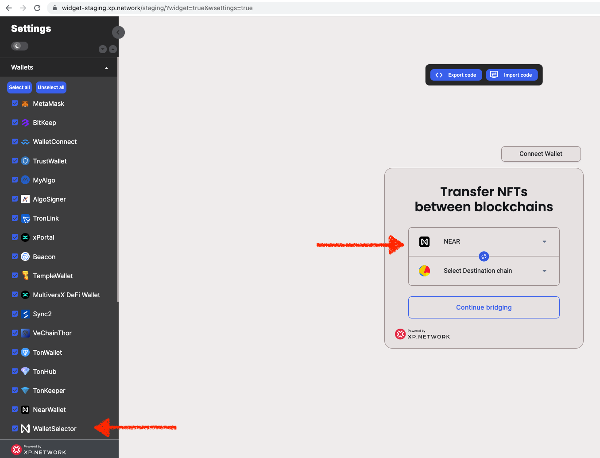
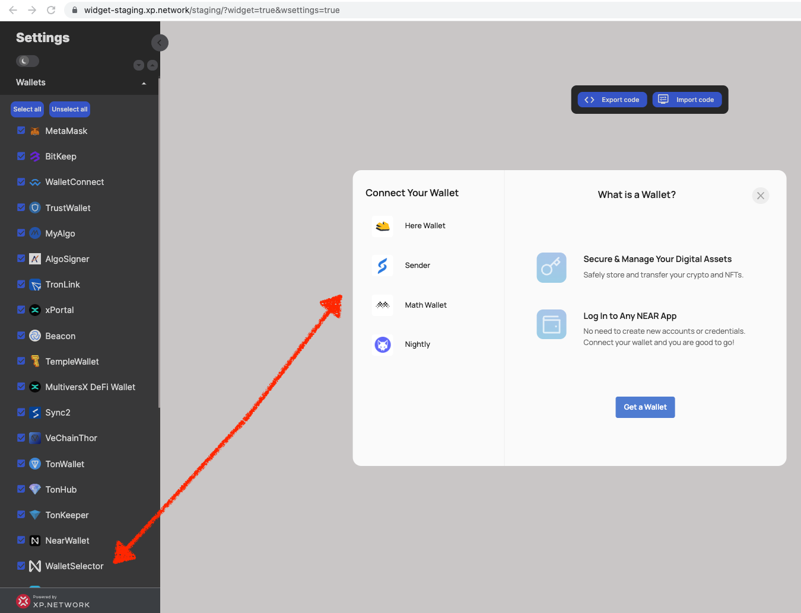

# Milestone 4 Delivery Proofs

## 1. Validation Logic

The best proof of the proper validation logic is the list of successful transactions to and from NEAR. Click the chain names to view the transactions.

|NFT Type|From chain|To chain|
|:-:|:-:|:-:|
|Native|NEAR|[Polygon](https://polygonscan.com/tx/0xf2d44db2888c2a1650567c856f1344011758e8a20ef6c337e0873925205dfedb)|
|Foreign|[BSC](https://bscscan.com/tx/0x3ba9159ad5b484084961b218e4ff050d314c0b5ab0475f99d3cec3308a5fa51b)|[NEAR](https://explorer.near.org/transactions/BAGu6sNCcBDw3tmSaDddVbfhvq5fmvkYk3WhjzRaseGm)|


## 2. NFT Indexer

NFT Indexer is a tool that returns an array of NFTs of a particular NFT owned by an account. Indexed NFTs are displayed in NFT cards that help select the correct NFT for a transfer.



API Example: https://tools.xp.network/index/nfts/31/b6494959598c96cee8e4888034c38dac50f7acbc22ee6849a9f849ab695237df

## 3. Fee estimation

The fee estimation service does the folowing:

1. Retrieves the user balance
2. Estimates the trasnfer fee on the chain of destination in NEAR tokens
3. Estimated the contract deployment fee, if required on the chian of destination



## 4. Heartbeat

The heartbeat service is used by the bridge UI to activate or deactivate a chain in the UI. It monitors the liveliness of the validators, checks their balance and verifies responsiveness of the RPC nodes.

Only the Production version of the bridge is equipped with the service. All the transaction presented here were made on the Mainnet Staging version of the bridge. 

https://bridgestatus.herokuapp.com/status

```json
{
    "31": {
        "validators": [
        {
            "status": "alive"
        },
        {
            "status": "alive"
        },
        {
            "status": "alive"
        },
        {
            "status": "alive"
        },
        {
            "status": "alive"
        },
        {
            "status": "alive"
        },
        {
            "status": "alive"
        }
        ],
        "bridge_alive": true
    },
...
}
```

## 5. NEAR RPC Nodes:

Testnet: https://github.com/XP-NETWORK/xpjs/blob/production/src/consts.ts#L62

Staging: https://github.com/XP-NETWORK/xpjs/blob/production/src/consts.ts#L98

Mainnet: https://github.com/XP-NETWORK/xpjs/blob/production/src/consts.ts#L98

## 6. NEAR in the bridge UI

Due to multiple images and content this section was moved to a [separate file](./mainnet_UI.md).

## 7. Deployed smart contract

|Name|Address|Functionality|
|:-:|:-:|:-:|
|Testnet Bridge|xp_new_bridge.testnet|Orchestrats validaors & NFT contracts transactions|
|Staging Bridge|e138f27300334f546bbd792e65dc8753af29d534c5248a3f55e875693bddcf19|Orchestrats validaors & NFT contracts transactions|
|Production Bridge|-|Orchestrats validaors & NFT contracts transactions|
|Default testnet NEP-171|xp_new_nft.testnet|Accepts NFTs arriving without target contracts|
|Default staging NEP-171|damphir7.near|Accepts NFTs arriving without target contracts|
|Default mainnet NEP-171|-|Accepts NFTs arriving without target contracts|

## 8. NEAR in XP.NETWORK JavaScript Library

Link: https://github.com/XP-NETWORK/xpjs/search?q=near&type=commits

## 10. Bridge Widget

Example: https://widget-staging.xp.network/staging/?widget=true&wsettings=true

10.1 NEAR can be (de)selected as the departure or destination chain:



10.2 Wallets available for signing on NEAR in the widget:



10.3 Wallets available via `WalletSelector`:



