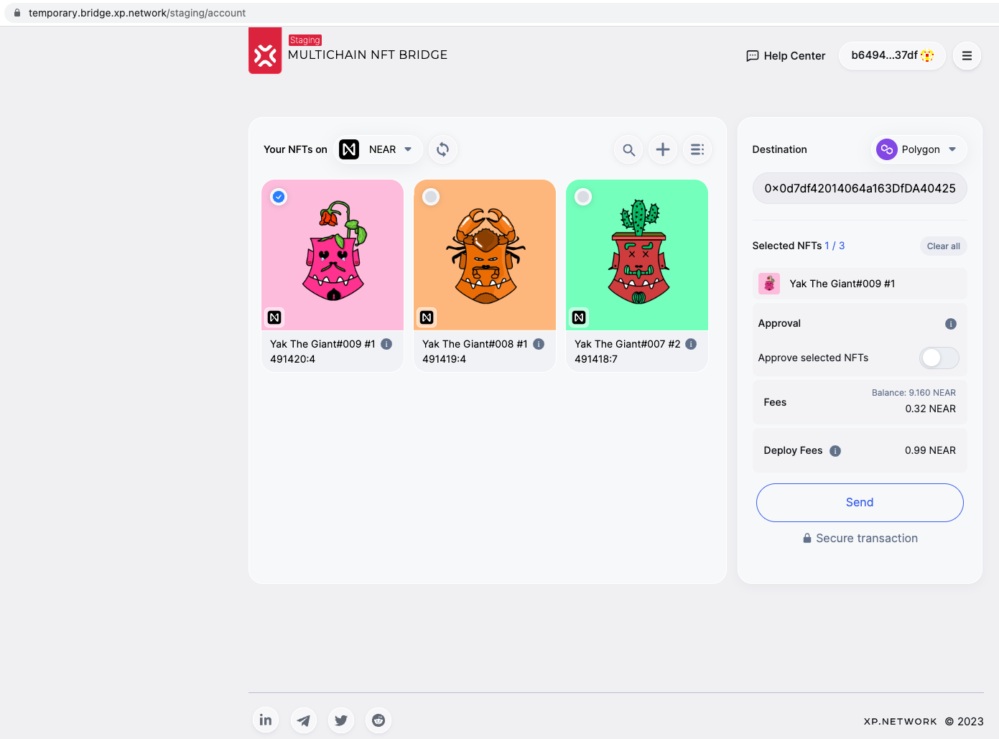
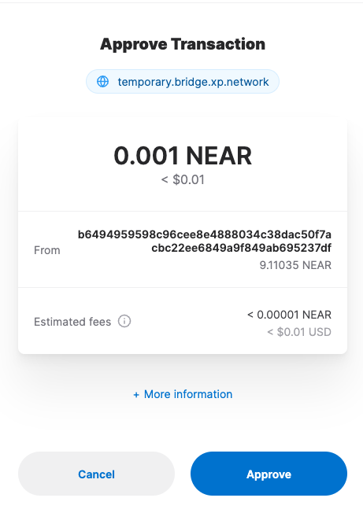
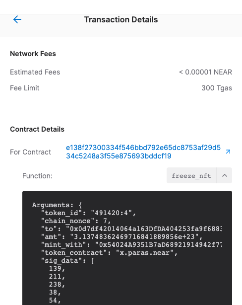
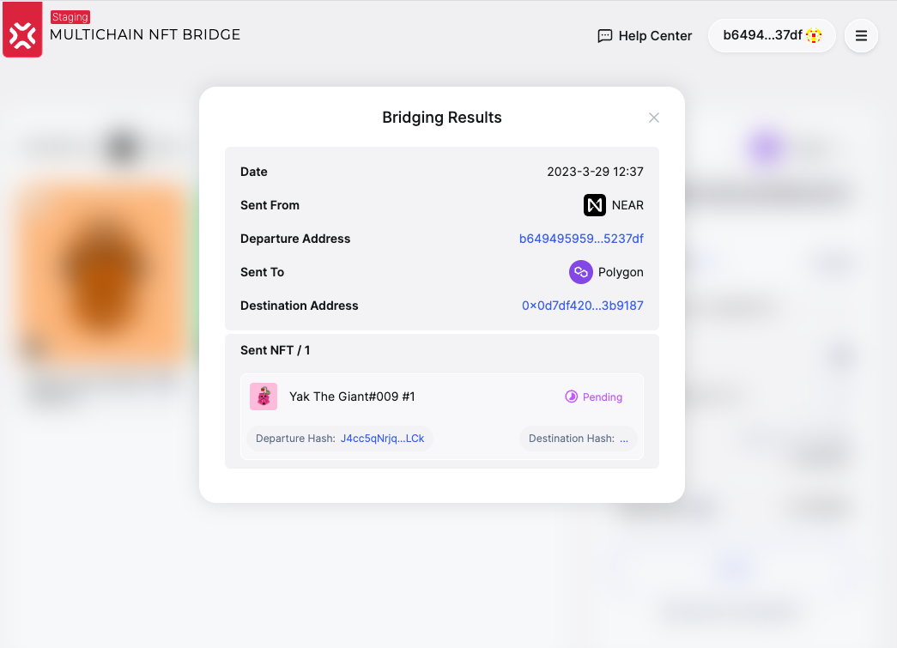
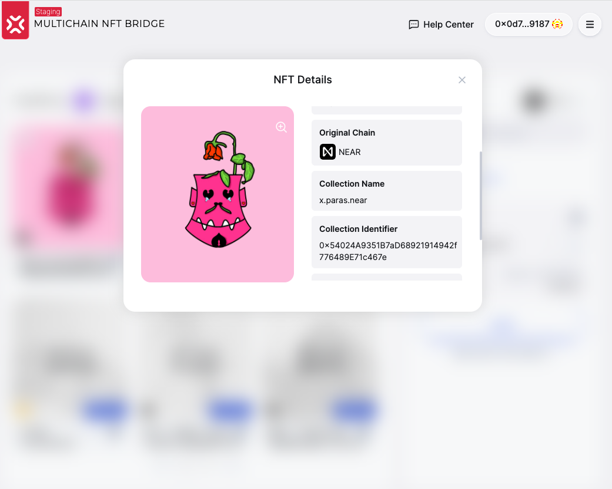

# NEAR Mainnet Transactions

The tests have been carried out on the temporary/staging bucket:

https://temporary.bridge.xp.network/staging

## 1. Loggin in the wallet

1.1 We successfully logged in the bridge via the `NEAR Wallet` browser extention.
1.2 NFT Indexer retrieved NFTs owned by the account
1.3 The balance of the account has been retrieved from the chain
1.4 The `fee-estimator` estimated the expected fee on the destination chain in the NEAR native tokens



## 2. Approving

2.1 The bridge correctly detected that the sellected NFT has not been approved
2.2 Sliding the approval slider openned the `NEAR Wallet` browser extention pop-up window.



Transaction: https://explorer.near.org/transactions/5MNXdzsoD4BSKojCwLCeTWce1LYQnQEr9EQSsf29jjUD


## 3. Transferring Native

Transaction arguments:
```JSON
"token_id": "491420:4",
"chain_nonce": 7,
"to": "0x0d7df42014064a163DfDA404253fa9f6883b9187",
"amt": "3.13748362469716841889856e+23",
"mint_with": "0x54024A9351B7aD68921914942f776489E71c467e",
"token_contract": "x.paras.near"
```



Transaction: https://explorer.mainnet.near.org/transactions/J4cc5qNrjqLgMqzYDB7d68gsBwo4ieNTgCxaGe6iNLCk



Arrived to Polygon:

https://polygonscan.com/tx/0xf2d44db2888c2a1650567c856f1344011758e8a20ef6c337e0873925205dfedb

Wrapped NFT: https://staging-nft.xp.network/w/30992054695599099560468151779

image: https://ipfs.io/ipfs/bafybeiei5itwp4m2np7ixgsqahakm45wkfa7gefdfeklebjr4uiyw2uclm

Native NEAR on an EVM Marketplace: https://rarible.com/token/polygon/0x54024a9351b7ad68921914942f776489e71c467e:30992054695599099560468151779?tab=properties



## 4. Transferring Foreign NFTs to NEAR

Transferrd from BSC: https://bscscan.com/tx/0xededf8aadaf58ceee100dceb37b4bc9545eced80c19d86f18ccd5f014e0fc47d

Arrived on NEAR:[ https://explorer.near.org/transactions/FoW1ty5X8JVC7HDBjUed2XDPZCYjqxnF2WLRBdxWkmVH](https://explorer.near.org/transactions/C9jQHA93mFDHNXD9PM6H8Wy7nJKgprLcdqV6K3hz5Em1)

Another transaction - (checking royalties):

BSC: https://bscscan.com/tx/0x89c8bdcf86f23f2f08db45fb2a44b7bff09038c1405f839519713123d4da74e7

Near: https://explorer.near.org/transactions/6ofc2ufUhc5vdHEukpqgoyYxbfD5m1rq5P5FpLrwzLJn

```json
"perpetual_royalties": {
    "b6494959598c96cee8e4888034c38dac50f7acbc22ee6849a9f849ab695237df"
    : 250
}
```